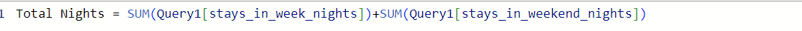
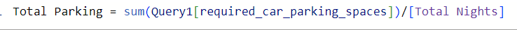
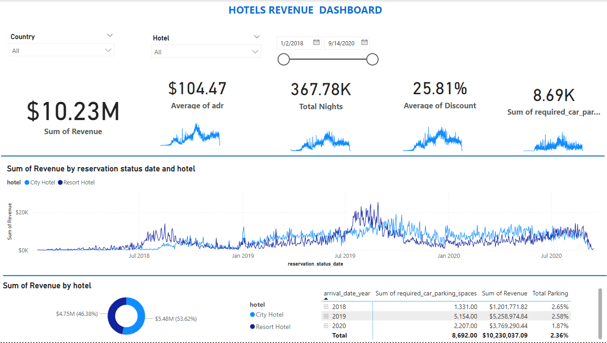

# Hotel Revenue Analysis

## Introduction

I came across the dataset online and admired how rich the data is as I have been trying to get my hands dirty with a very rich dataset to practice my skills of data cleaning, analysis and visualization.

## Power BI Concepts applied:

 **DAX Concepts:** Custom Columns and Measure 
 
## Goal 

Develop a Database to analyse and visualise Hotel Booking Data

## Problem Statement

1) Is hotel revenue growing by year?
2) Should we increase our parking lot size?
3) What trends can we see in the data? Focus on average daily rate and guests to explore seasonality 

## Data Sourcing

Not until I came up with the above-mentioned questions did I go ahead to get the data. I then downloaded the csv file, and extracted it into SQL Server and Power BI  for cleaning, analysis and visualization.

It contains 5 sheets/tables:

Year 2018,  2019 and 2020 with 21997 rows and 32 columns
Meal_cost with 6 rows and 2 columns
RETURNS with 9 rows and 2 columns

## Data Transformation/Cleaning:

Data was efficiently cleaned and transformed with the Power Query Editor of Power BI. [a screenshot of the applied steps] Some of the applied steps included
 To have an idea of how revenue that was generated by each transaction a “Revenue” column was created. Using "custom columns", Revenue = ([stays_in_week_nights] +[stays_in_week_nights]*([adr]*[discount])
 
A new measure were created for both Total nights and Total parking respectively as shown below 

## Data Analysis and Visuals

From the dashboard it is observed that
Total Revenue made  in 2018 by City hotel = $425.28k, in 2019 = $3.04M and in Sept. 2020  = 2.02M while the Resort hotel in 2018 = $802.37k, in 2019 = $2.45M and in Sept. 2020 = 1.49M.
These shows that the hotels revenue grow by year.
The parking lot size does not have a significant effect on the revenue generated. Therefore increasing parking lot space is not recommended
Total customer bookings increase during June through October. Family summertime outings can be a possible explanation for this insight.

## Conclusion:
The analysis of the revenue data for City and Resort hotels reveals a positive growth trend over the years, with City hotel revenue increasing from $425.28k in 2018 to $3.04M in 2019 and Resort hotel revenue rising from $802.37k in 2018 to $2.45M in 2019. The overall trajectory indicates a positive financial performance.

## Recommendations:

1.	Maintain Focus on Seasonal Trends: Given the observed increase in total customer bookings from June through October, both City and Resort hotels should maintain a focus on attracting customers during these months. Capitalizing on family summertime outings can be a strategic approach to further enhance bookings during this period.

2.	Optimize Marketing Strategies:

To sustain and potentially accelerate revenue growth, hotels should invest in targeted marketing strategies, particularly during peak booking months. Emphasizing family-friendly amenities and promotions during the summertime can be effective in attracting a broader customer base.
